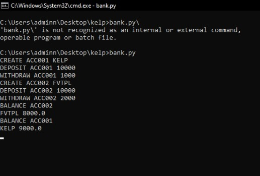

# kelpGlobal
Banking Application

## Setup
* Run the program with `python.exe Bank.py`

## Inputs
* Create Account with `CREATE <CODE> <NAME>`
* Deposit Amount with `DEPOSIT <CODE> <AMOUNT>`
* Withdraw Cash with `WITHDRAW <CODE> <AMOUNT>`
* Check Balance with `BALANCE <CODE>`

## Output

